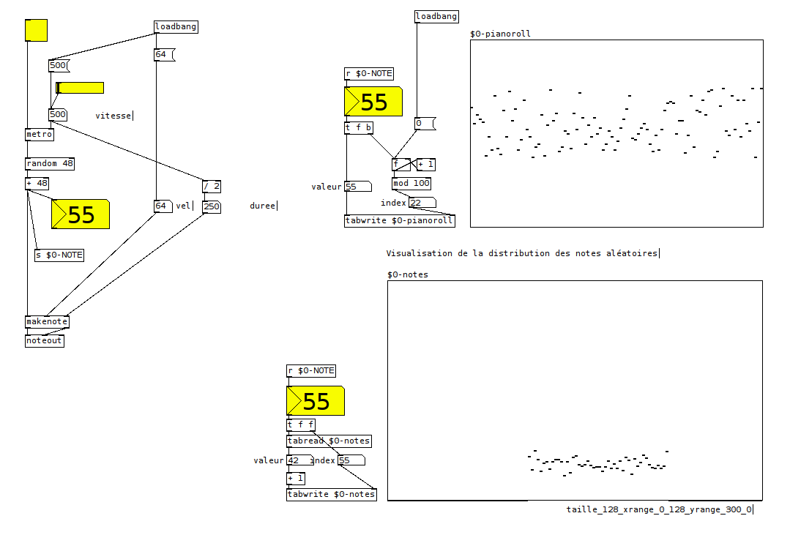
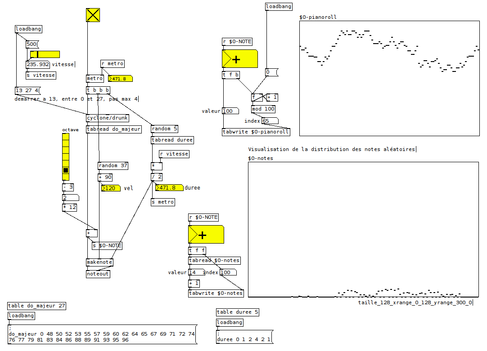
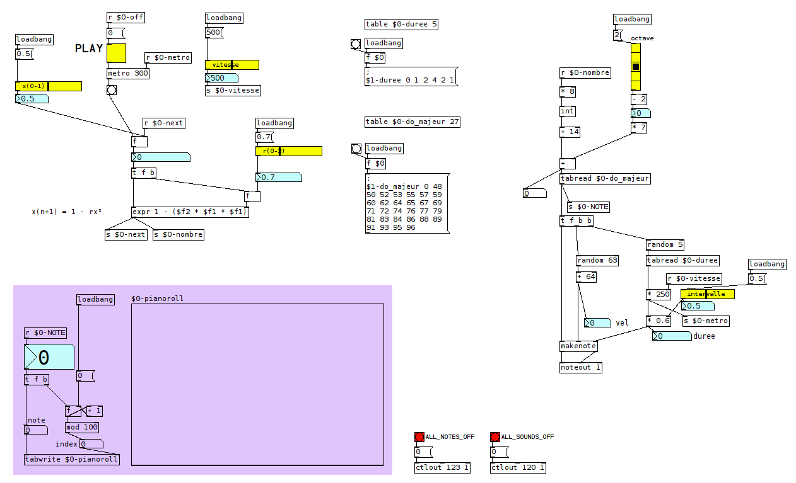
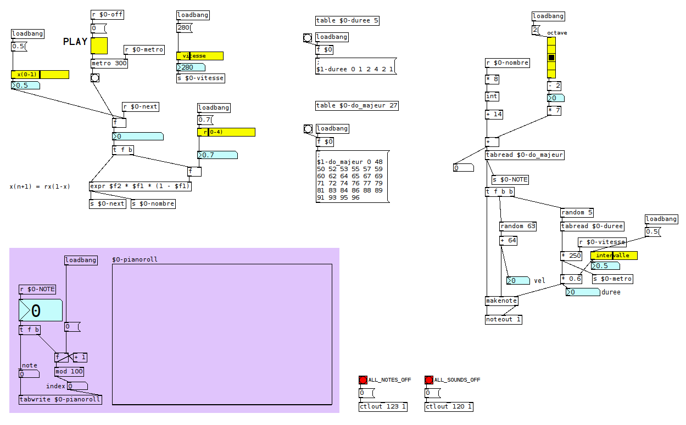
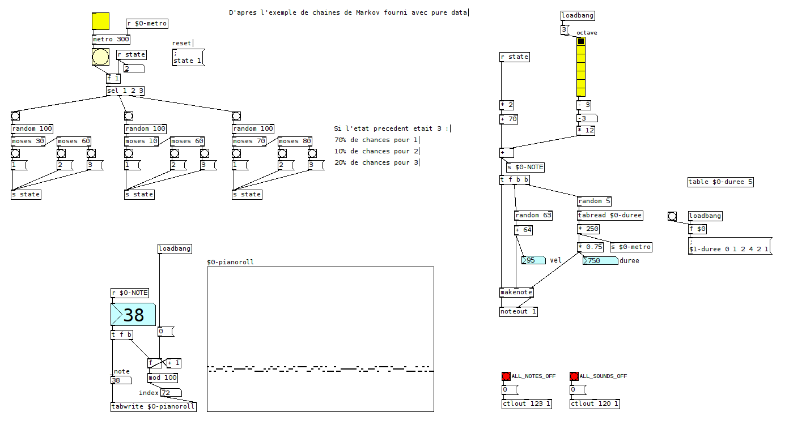
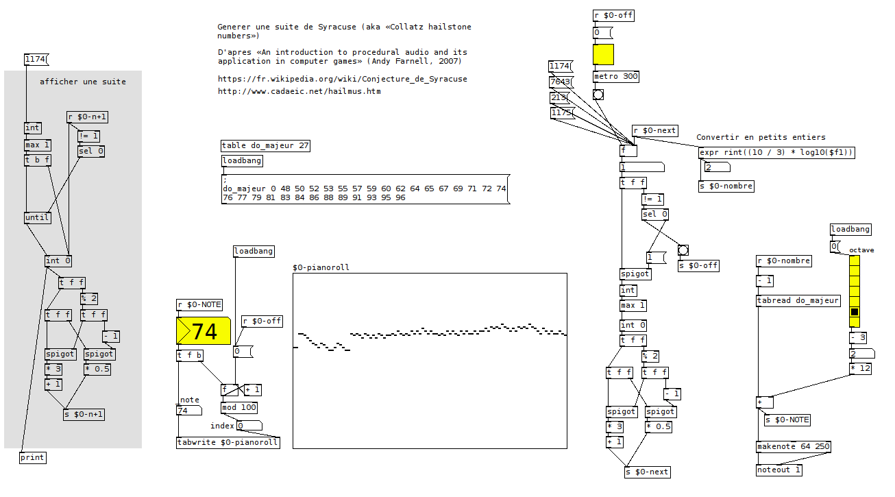
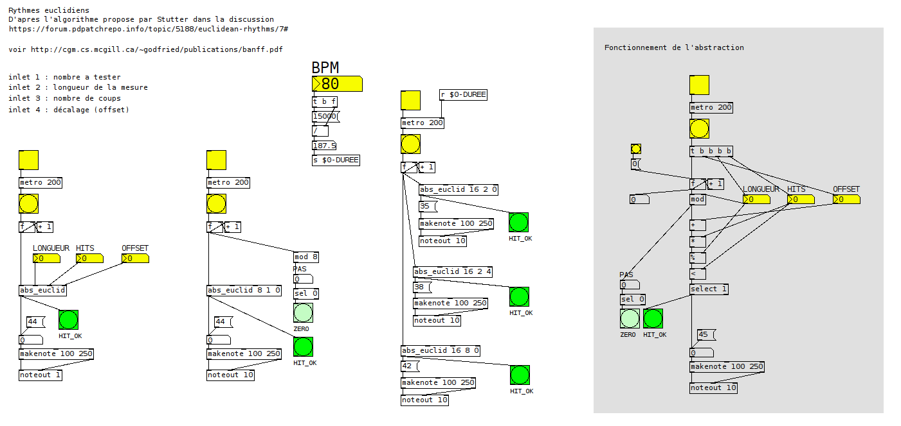
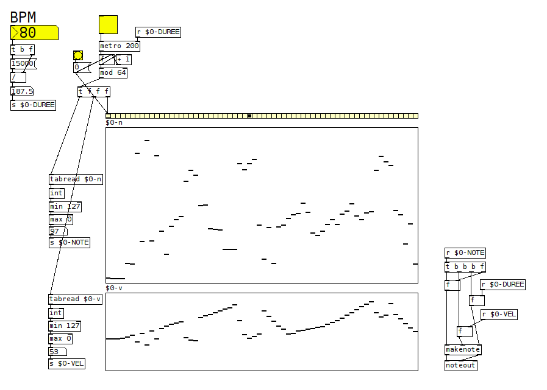

Tactiques de composition générative avec Pure Data. Exploration de différents modes opératoires (hasard, suites et algorithmes).  
Autant que possible les patchs sont présentés «à plat», et produisent des notes MIDI.  
Une bonne partie des patchs se base sur des références disponibles en ligne.  

### Notes aléatoires

Tirage aléatoire de notes sans contraintes particulières. Les notes sont représentées visuellement dans deux tableaux au fur et à mesure : sous forme d'un piano roll et de leur distribution statistique.

### Marche aléatoire

Tirage aléatoire de valeurs contraintes en fonction de la précédente valeur («random walk»). Les valeurs servent d'index à la lecture d'un tableau de notes MIDI sur la gamme de do majeur.

**sources**
* https://fr.wikipedia.org/wiki/Marche_al%C3%A9atoire

### Suites chaotiques

Deux exemples de suites numériques chaotiques, définies par 2 paramètres (choisir des valeurs élevées pour ces paramètres) :

#### suite avec xn+1 = 1 - rx²

#### suite avec xn+1 = rx(1-x)

**sources**

* [Elaine Walker - Chaos Melody Theory (2001)](http://www.ziaspace.com/elaine/chaos/ChaosMelodyTheory.pdf)

### Chaînes de Markov

Machine à état statistique

### Suite de Syracuse

Suite établie à partir d'un nombre d'entier positif, s'il est pair on le divise par 2, s'il est impair on le multiplie par 3 et on ajoute 1, puis on recommence!  
Les nombres produits pouvant être grands, on les réduit en prenant leur logarithme en base 10.

**sources**

* An introduction to procedural audio and its application in computer games» (Andy Farnell, 2007)
* https://fr.wikipedia.org/wiki/Conjecture_de_Syracuse
* http://www.cadaeic.net/hailmus.htm

### Séquenceur de rythme euclidien

Séquenceur paramétrable sur le principe des rythmes euclidiens.

**sources**
* http://cgm.cs.mcgill.ca/~godfried/publications/banff.pdf
* https://forum.pdpatchrepo.info/topic/5188/euclidean-rhythms/7#
* https://www.hisschemoller.com/mpg

### Séquenceur MIDI 64 pas avec vélocité

Hors-sujet!

### Quelques liens pour la suite
* https://en.wikipedia.org/wiki/List_of_chaotic_maps
* [Peter Langston - Six techniques for algorithmic composition (1988)](
http://peterlangston.com/Papers/amc.pdf)
* https://puredata.info/downloads/chaos/releases/0.2
* http://www.algorithmiccomposer.com/2011/06/tom-johnsons-self-similar-melodies.html
